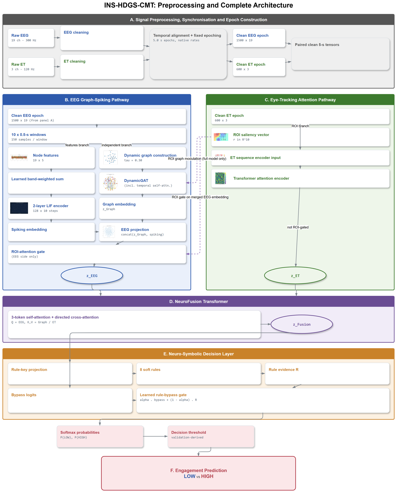

<div align="center">

# INS-HDGS-CMT

### Dynamic Functional Graph Learning for Subject-Independent Consumer Engagement Decoding from EEG and Eye Tracking: A Leakage-Aware NeuMa Study

[](https://www.python.org/)
[](https://pytorch.org/)
[](LICENSE)
[](#citation)
[](reproducibility/)

**Priyadharshini D** · **Shridevi S**
Centre for Neuroinformatics, Vellore Institute of Technology, Chennai, India

</div>

---

Official source code for **"Dynamic Functional Graph Learning for
Subject-Independent Consumer Engagement Decoding from EEG and Eye Tracking: A
Leakage-Aware NeuMa Study"**, submitted to *Brain Informatics* (Springer
Nature).

## Overview

Consumer engagement is central to advertising effectiveness, yet self-report
measures are retrospective and biased. EEG and eye tracking provide
complementary objective measures, but existing frameworks often rely on simple
fusion, subject-mixed evaluation that overstates generalisation, and static
within-trial connectivity.

**INS-HDGS-CMT** — the Interpretable Neuro-Symbolic Hybrid Dynamic Graph Spiking
Cross-Modal Transformer — is a subject-independent framework that:

1. represents each EEG epoch as a **sequence of dynamic functional-connectivity
   graphs**, encoded with **graph-attention** (including temporal
   self-attention) and **spiking (LIF)** modules;
2. encodes gaze/pupil dynamics with a **Transformer attention** branch and an
   **ROI-saliency** signal;
3. **fuses** the modalities with a **cross-modal (NeuroFusion) transformer**; and
4. exposes each decision through a **neuro-symbolic soft-rule layer** with a
   learned rule/bypass gate.

Evaluation uses **leave-one-subject-out cross-validation (LOSOCV)** on the public
**NeuMa** dataset — the strict, subject-independent protocol.

<div align="center">

</div>

## Leakage-aware evaluation — please read first

Engagement labels in NeuMa are **derived from gaze features** (mean per-fold
ROC-AUC 0.67 from the label's own EEG terms, 0.92 from its gaze terms, under a
linear probe). Any model that receives eye tracking as input is therefore
partly reconstructing its own label source, so this repository keeps two
claims strictly separate:

| Claim | Branch | ROC-AUC | Status |
|---|---|---|---|
| Label-coupled (headline) | Full multimodal (EEG + ET) | **0.88** | Matches, does not exceed, the best individually tuned single-modality baselines |
| **Leakage-independent (control)** | **EEG-only** — never accesses gaze | **0.59** | Statistically indistinguishable from eight tuned EEG encoders (37-fold Wilcoxon, Holm-corrected; three baselines score numerically higher) |

**The controls are the main result, not a side note.** Removing the graph
pathway costs 0.09 balanced accuracy, but replacing the measured dynamic
connectivity with density-matched static or random graphs costs nothing — so
the graph pathway acts through its node-feature processing, not through the
measured connectivity topology. Read this as: the dynamic-graph and spiking
components are representations worth studying, not a demonstrated source of
predictive accuracy on this label. Full detail, effect sizes and every
comparison are in the manuscript.

## Dataset

This study analyses the **publicly available NeuMa dataset** (EEG + eye
tracking). **No new data were generated in this work**, and raw recordings are
**not redistributed** here. See [`datasets/README.md`](datasets/README.md) for
how to download it, the expected folder layout and the required preprocessing.

> Georgiadis, K., Kalaganis, F.P., Riskos, K. *et al.* NeuMa — the absolute
> neuromarketing dataset en route to a holistic understanding of consumer
> behaviour. *Sci Data* **10**, 508 (2023).
> https://doi.org/10.1038/s41597-023-02392-9

The recordings are deposited on figshare under CC BY 4.0 — raw release:
https://doi.org/10.6084/m9.figshare.22117001; preprocessed release:
https://doi.org/10.6084/m9.figshare.22117124. Cite both the descriptor and the
deposit you use.

## Requirements

- Python ≥ 3.11
- PyTorch 2.x — install separately, matching your CUDA version
- See [`requirements.txt`](requirements.txt) / [`environment.yml`](environment.yml)

## Installation

```bash
git clone https://github.com/priyadharshini-D29/INS-HDGS-CMT.git
cd INS-HDGS-CMT

# 1) install PyTorch matching your machine (GPU shown; use plain `pip install torch` for CPU)
pip install torch --index-url https://download.pytorch.org/whl/cu124

# 2) install the rest
pip install -r requirements.txt          # or:  conda env create -f environment.yml
pip install -e .                         # installs the `ins_hdgs_cmt` package (optional)
```

## Quick start

```bash
# Smoke test on a single held-out subject
python src/model/main.py --subject S24 --epochs 5 --n-ensemble 1
```

## Training

```bash
bash reproducibility/train.sh
# equivalent to the headline configuration:
python src/model/main.py \
  --focal-gamma 3.0 --alpha-strategy effective_num \
  --n-ensemble 5 --lambda-dann 0.1 --lambda-mmd 0.1 \
  --mmd-mode marginal --norm-mode zscore
```

## Evaluation

```bash
bash reproducibility/evaluate.sh
```

Writes balanced accuracy, MCC, ROC-AUC, PR-AUC, Cohen's κ and F1 to `results/`.

## Ablation studies

```bash
bash reproducibility/run_ablation.sh              # all variants
bash reproducibility/run_ablation.sh no_snn       # a single variant
```

See [`ablation/README.md`](ablation/README.md) for the full variant list.

## Reproducing the paper's experiments

```bash
bash reproducibility/reproduce_paper.sh   # full pipeline
bash reproducibility/run_all.sh           # env check + train + eval + ablation + tables + figures
```

Or stage by stage:

```bash
bash reproducibility/train.sh              # LOSOCV training
bash reproducibility/evaluate.sh           # metrics
bash reproducibility/run_ablation.sh       # ablation
bash reproducibility/generate_tables.sh    # tables
bash reproducibility/generate_figures.sh   # figures
```

All experiments use a fixed base random seed (**42**) applied identically to the
Python, NumPy and PyTorch generators across folds. Measured runtimes and
expected metric values:
[`docs/REPRODUCIBILITY_CHECKLIST.md`](docs/REPRODUCIBILITY_CHECKLIST.md).

> LOSOCV over all subjects is GPU-intensive. CI should run only the smoke
> tests in [`tests/`](tests/); it should not train.

> **Note on exact numbers.** Re-running the pipeline reproduces the reported
> results within ordinary run-to-run variance (calibrated accuracy within
> ~0.25 pts, MCC within ~0.012, AUC within ~0.015), not bit-for-bit.

## Testing

```bash
pytest -q                      # smoke tests (see tests/)
```

## Repository layout

```
INS-HDGS-CMT/
├── src/                 Source code (model package + data pipeline)
│   ├── model/           GAT · SNN · cross-modal transformer · neuro-symbolic layer, training, eval, explainability
│   └── data_pipeline/   EEG/ET validation → QC → preprocessing → segmentation → features → aggregation
├── configs/             Modular YAML configs (model / training / evaluation / hyperparameters)
├── reproducibility/     One-command scripts to reproduce every experiment
├── ablation/            Ablation manifest + docs (driver in reproducibility/)
├── scripts/             Figure + analysis/statistics generators
├── docs/                Architecture reference, checklists (reproducibility / release)
├── datasets/            How to obtain & preprocess NeuMa (no raw data redistributed)
├── checkpoints/         Trained weights (not committed; regenerate via training)
├── notebooks/           Exploratory notebooks
├── examples/            Small example outputs
├── tests/               Smoke tests (run in CI)
└── assets/              Static images used by the README/docs
```

Each folder contains its own `README.md` explaining what belongs there.
`results/`, `logs/` and `datasets/raw/` are created locally by the pipeline and
are not tracked in this repository (see `.gitignore`).

## Expected outputs

- Per-fold LOSOCV metric CSVs in `results/losocv_metrics/`
- ROC / PR / confusion / calibration plots in `results/`
- Regenerated tables in `tables/` and figures in `paper/figures/` (both created
  on demand by the reproduction scripts)

Reference numbers for a correct run are listed in
[`docs/REPRODUCIBILITY_CHECKLIST.md`](docs/REPRODUCIBILITY_CHECKLIST.md).

## Citation

If you use this code or results, please cite the paper (machine-readable
metadata in [`CITATION.cff`](CITATION.cff)):

```bibtex
@article{inshdgscmt2026,
  title   = {Dynamic Functional Graph Learning for Subject-Independent Consumer
             Engagement Decoding from EEG and Eye Tracking: A Leakage-Aware NeuMa Study},
  author  = {D, Priyadharshini and S, Shridevi},
  journal = {Brain Informatics},
  year    = {2026},
  note    = {Under review}
}
```

Please also cite the **NeuMa dataset** (Georgiadis et al., 2023).

The files submitted to the journal on 18 September 2026 (manuscript PDF, supplementary PDF and LaTeX source) are archived unchanged in [submission/2026-09-18/](submission/2026-09-18/).

## License

Released under the [MIT License](LICENSE). The NeuMa dataset is subject to its
own licence and terms.

## Acknowledgements

We thank the authors of the **NeuMa** dataset for making it publicly available,
and **NVIDIA Corporation** for GPU computing resources provided through the
NVIDIA Academic Grant Program, which accelerated training, hyperparameter
optimisation and subject-independent evaluation. This work builds on the
open-source PyTorch, MNE-Python and scientific-Python ecosystems.

## Contact

- **Priyadharshini D** — priyadharshini.2024b@vitstudent.ac.in
- **Shridevi S** — shridevi.s@vit.ac.in (corresponding author)

Centre for Neuroinformatics, Vellore Institute of Technology, Chennai, India.

For code questions, open a
[GitHub issue](https://github.com/priyadharshini-D29/INS-HDGS-CMT/issues).
